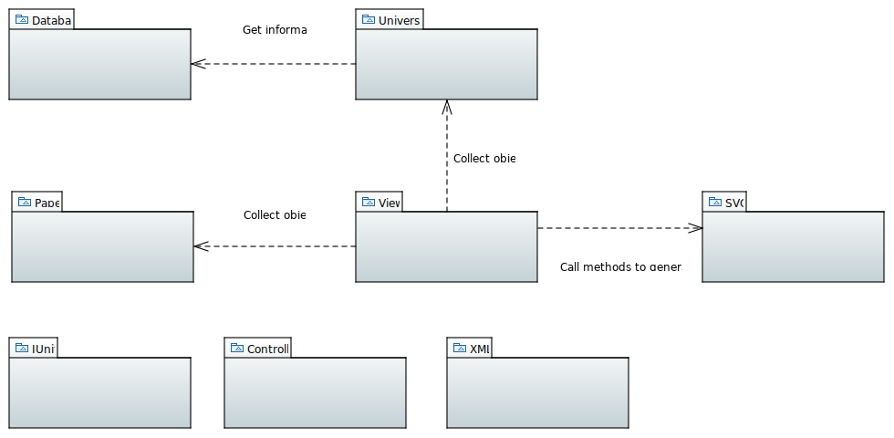
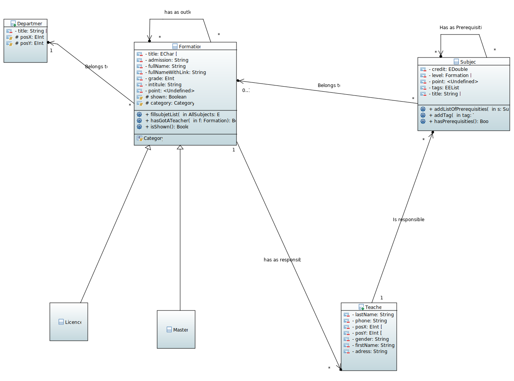
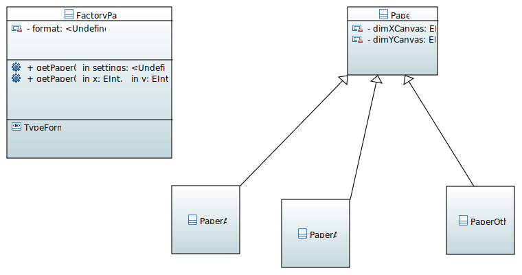
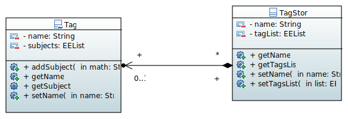
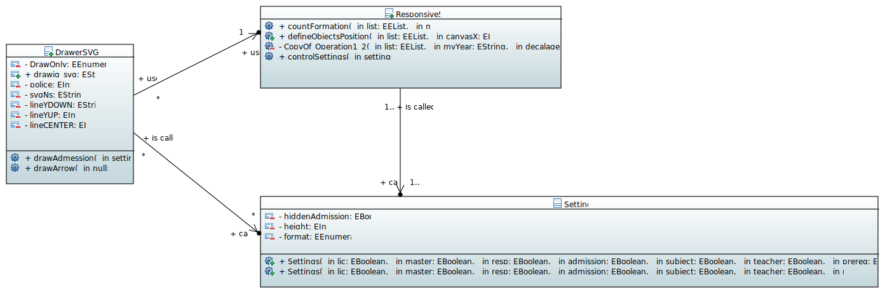
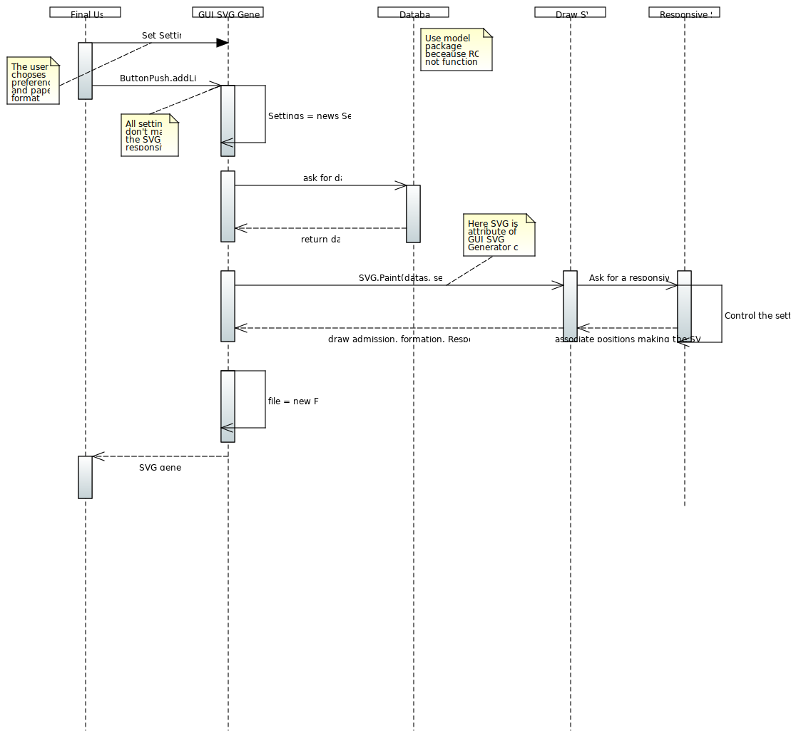
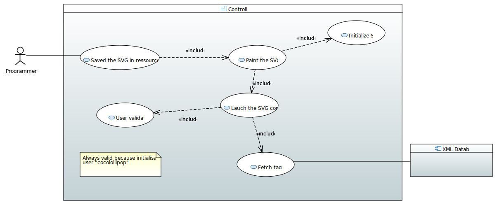

= Diagram Documentation File

== General
=== MIDO-SVG Diagram

This diagram aim to represent an overview on our application.
 `Controller` package is no longer useful to us and will therefore be deleted in the next java iteration.

You can see the details of all these packages just below

== University

=== University Class Diagram 

The `Department` class represents the different Departments of the university (MIDO, LSO ...)
The `Formation` class is abstract, which will allow us to create other types of training with the same "default data" (a title, a grade ...)

The `UniversityClassDiagram` diagram allows you to view the different links between the classes in this package.
 
This package seems complete and functional to us, so we do not anticipate any major developments on this part of the project. However, additions of methods or attribute can be made if necessary to allow another evolution.

PS : We do not proceed to the suppression of Master et Licence and the attribut posX eand posY class, because it needed to draw the SVG file

== View

=== GUI Use Case Diagram 

image::../docs/Diagrams/View/GUIUseCaseDiagram.svg[GUI Use Case Diagram]

The "GUI" aspect of the project is coded in the `view` package.
We observe that Mac user and Windows user didn't see the same thing. Windows user saw a unesthetic GUI form.
At this point of the project, there is no specific main class to run.
If we run the GUISVGLoginForm, the final user is able to log in (if the final user name is known by the application, coded in "model" database class.
On the other hand, if the programmer run another class, the name user is by default "ocailloux".
The big change here is to allow a user to acces to home page without the login process, a default value to "User"

The tag is saved in an xml file in `src/main/resources/tags/`

Pretty much same elements that the https://github.com/marcellinodour/MIDO-SVG/blob/master/docs/Diagrams/JUnit/JUnitUseCaseDiagram.svg[JUnit Use Case].
This is what we are planned to do :
[square]
* Saved the user preferences in a xml file and reuse it in a further launch application
* Be able to save courses preferences 
* Be able to access to the formation site by clicking on it

== Paper

=== Paper Class Diagram 

 
The https://github.com/marcellinodour/MIDO-SVG/blob/master/docs/Diagrams/Paper/PaperClassDiagram.svg[Paper Class Diagram] allows you to visualize the different links between the classes of this package.

== XML

=== XML Class Diagram 

The `xml` package enables us to generate tags and therefore make the link with the subjects.
Each tag has a name and a list of subjects.
The TagStore class allows you to store several tags.
In the future, we want to be able to choose the courses by tags. 

The `XMLMain` class (in the xml-to-java package) is used to retrieve an XML file and extract the data (name, first name, address, etc.) to store it in a hash table. Afterwards, this hash table will be used to fill the tags. 

== Database

=== ROF Class Diagram 

image::../docs/Diagrams/Database/ROFClassDiagram.svg[ROF Class Diagram]

This diagram contains the classes that would be useful to retrieve the data directly from ROF. 
`Querier` Class enables us to get the mentions, programs, courses ... from ROF. 
`DataRecuperator` class uses `Querier` class to get all the useful informations from ROF and create objects with them.
`DataRecuperator` also uses the `ObjectTransformer` class to transform the objects retrieved by the `Querier` class (and then create objects from the `University` package).
`QueriesHelper` is essential to login into ROF. 
The last class `ROFMain` will be useful to store the data (retrieved with calling `DataRecuperator` and `QueriesHelper` classes) in a file which will be read by the SVG generator. 

== SVG

=== SVG Class Diagram

This diagram models the `svg-generator package`. It represents an overview of drawing an SVG process: the classes involved and the methods.
However, the process is much detailed in the SVG Sequence Diagram. 

=== SVG Sequence Diagram 

This diagram represents the way a SVG image is generated by using the `View` package 

There is another way to generate the SVG image by using the `ControllerSVG` class in the `controller` package that makes the SVG image more responsive (according to the default settings)

== Controller

=== Controller Use Case Diagram 

Based on the model of MVC system, the generation of a svg file require a control step.
By running `ControllerSVG` from `Controller` package, the application proceed to a user validation. (if the user is unknown by the application, the SVG file won't generate.
To make the application runnable (able to generate SVG file), the previous programmer set, as a hard-coded procedure, the user `cocolollipop`.

The controller step is not a priority in term of evolution, thus we decided to do anything.

