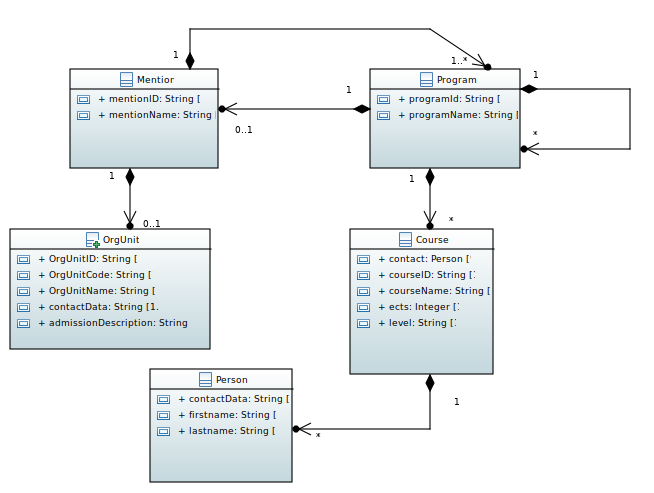

=== ROF  Dauphine Class Diagram 

*OrgUnit* is a table that regroup the major departments in Dauphine University (MIDO, LSO...). Each row of the table contains 
	** a label under this form `FRUAI0750736TOU******`. This label is the OrgUnitId which is the key that we can use as a predicate for the `Querier` class' methods.
	** details which is an URL to this row of OrgUnit
	** content which regroup the OrgUnitId, OrgUnitCode, OrgUnitName, admissionDescription and contact data.
	

As we can see in the diagram, OrgUnit does not point to any other table. That means there is no link between the MIDO department and the MIDO formations. 
If only in OrgUnit content, there was a list, let's name it refMentions, that contains a reference to all MIDO formations, it would be much easier to fetch all the informations that we need just by recovering the MIDO department key which is ``FRUAI0750736TOU0755233F``.

*Mention* is a table containing all the formations in Dauphine University. Each Mention has this content:
	* mentionId
	* name
	* structure
		** refCourse : we've noticed that refCourse is always an empty array (regardless of the mention). We concluded that the Courses are stored in the Programs.
		** refProgram : a list of Program's label. 
	* ... (there's too many attributes, we focus on the most important ones)
	* contacts 
		** refOrgUnit : this should normally point to the OrgUnit where the mention belongs. Unfortunately, for the examples that we've seen, this field is an empty array. 
		** refPerson : this should normally point to the responsible teacher, but it's also an empty array.
	
*Program* is a table containing several programs. Each one point to a list of several other programs. The structure is like below:
	* programId
	* programName
	* refMention : it contains the mention's label.
	* programStructure
		** refCourse 
		** refProgram 
To better explain the role of this table, and after a lot of researches in the database, we could schematize it as follows: 

 image::../Doc/ProgramScheme.png[Schema Program]
 
To conclude, a Program have either its refProgram field empty or its refCourse field empty. We can also say that the courses are stored only at the finest levels of Program. Therefore a program is either a grouping of other programs or a grouping of courses. To be more concrete a program can represent a "parcours", a "semestre", "UE obligatoires", "UE options"... So that makes sense. 

*Course* is a table containing all the courses given at Dauphine University. We can find these informations for each course:
	* courseId
	* courseName
	* ects
	* searchword : also known as tag
	* managing teacher : contains a reference to the table Person. This reference can be null so we have to deal with it.

*Person* is a table containing informations on all the teachers at Dauphine University.
	* personId
	* ident 
	...

The informations represented below are not complete. We chose to represent only the informations that we'll use in the context of this project. 

Small tip: In order to read the ROF database content, we use `codebeautify.org/jsonviewer`. By just copy/paste the content into this tool, you'll be able to have a more organized structure in which you can venture more comfortably. 