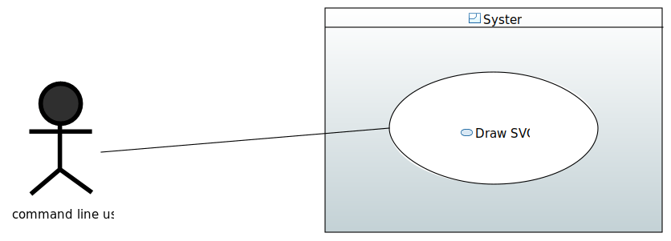

= MIDO SVG
:gitHubUserName: oliviercailloux
:groupId: io.github.{gitHubUserName}
:artifactId: mido-svg
:repository: MIDO-SVG

image:https://github.com/{gitHubUserName}/{repository}/workflows/Maven%20verify/badge.svg["Build Status", link="https://github.com/{gitHubUserName}/{repository}/actions"]

A Java project developed by students during the https://github.com/oliviercailloux/java-course[Java course] taught at Université Paris-Dauphine (in https://dauphine.psl.eu/en/training/bachelors-degrees/organizational-computer-science/bachelors3-business-informatics/program[MIAGE L3 Alternance]).

The code is hereby published under the https://github.com/oliviercailloux/{repository}/blob/master/LICENSE[MIT License], with their permission.

See the https://github.com/oliviercailloux/{repository}/blob/master/Doc/README.adoc[doc].

Our main focus will be to use Fake Data as a start. We will make sure that we are able to programatically an SVG from the command line.

