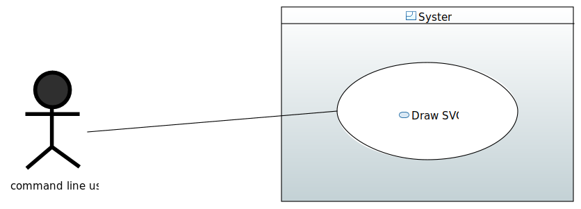
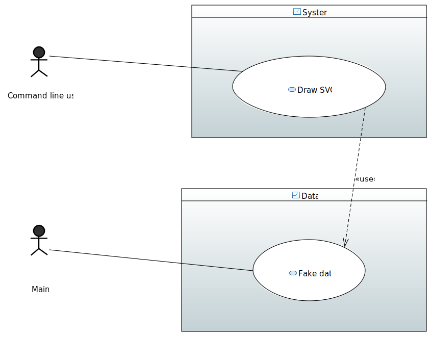

= MIDO SVG
:gitHubUserName: oliviercailloux
:groupId: io.github.{gitHubUserName}
:artifactId: mido-svg
:repository: MIDO-SVG

image:https://github.com/{gitHubUserName}/{repository}/workflows/Maven%20verify/badge.svg["Build Status", link="https://github.com/{gitHubUserName}/{repository}/actions"]

A Java project developed by students during the https://github.com/oliviercailloux/java-course[Java course] taught at Université Paris-Dauphine (in https://dauphine.psl.eu/en/training/bachelors-degrees/organizational-computer-science/bachelors3-business-informatics/program[MIAGE L3 Alternance]).

The code is hereby published under the https://github.com/oliviercailloux/{repository}/blob/master/LICENSE[MIT License], with their permission.

See the https://github.com/oliviercailloux/{repository}/blob/master/Doc/README.adoc[doc].

== Original description
The primary objective of this project is to create a library that allows a user to create a drawing (in SVG format) representing, by means of a tree, university programs offered in the MIDO department. It is also possible to display the details of the programs, the teachers, etc. The idea is to generalize and energize the library so that it can be used on a larger scale, by retrieving information from the university website.

== The focus of our part
Our main focus will be to use Fake Data as a start. We will make sure that we are able to programatically an SVG from the command line.

== Where does data come from 
It simply produces a set of fake data for use by the exporter. Currently, the program uses fake data but we will extend it to be able to take data from Dauphine DataBase. The request is done thanks to Dauphine API.

== How to fix ebx import error on Eclipse
To fix the issue, you need to get logins (username and password) from the IT service of Dauphine to connect to : https://rof.api.dauphine.fr/ebx-dataservices/tables/pvRefRof/RefRof?WSDL

When you have them, you have to create a `WSDL_login.txt` file in the project folder, with this format : https://username:password@*

Use the command line `mvn package` in your terminal to build the project, and get the library in the target folder.

Finally, in this folder, in generated-sources, right-click on **wsimport > Build Path > Use as source folder**

Refresh the project, and it should be fixed.