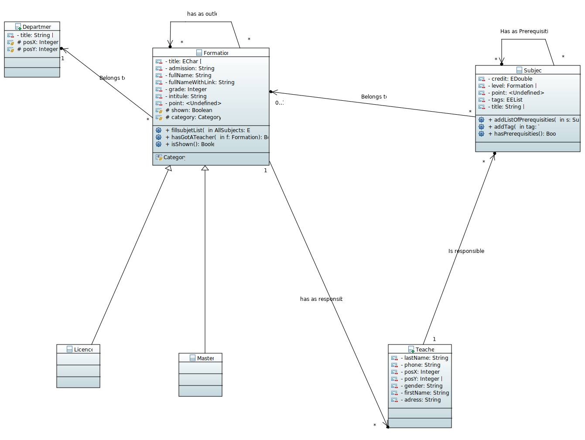
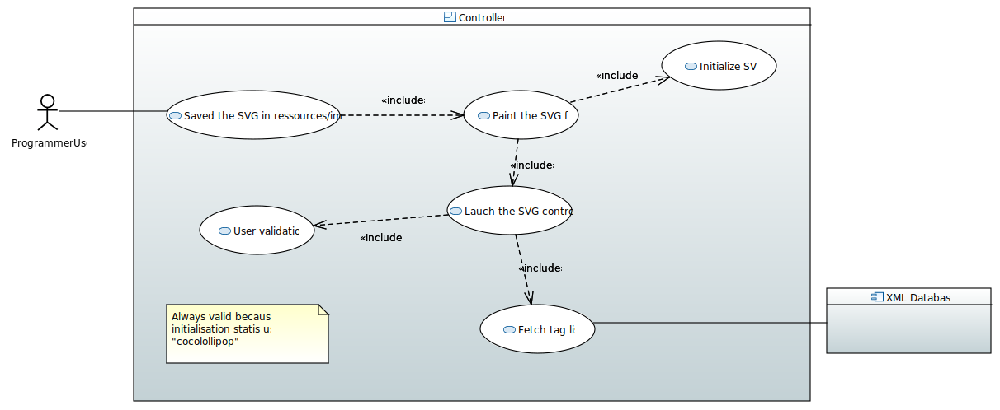
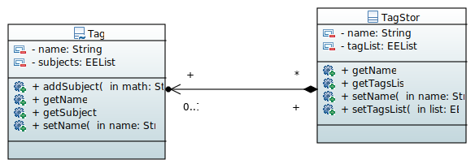
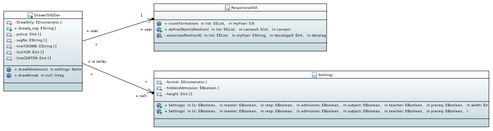
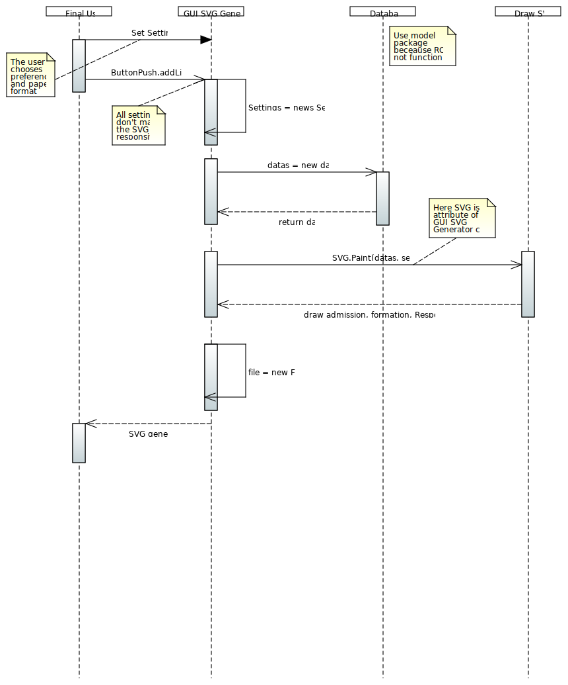
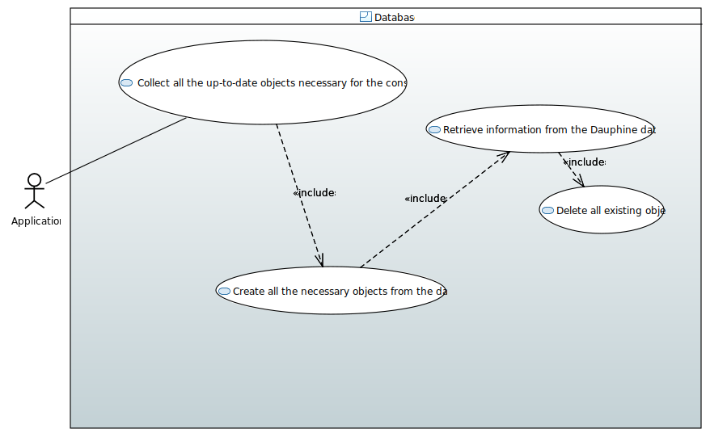
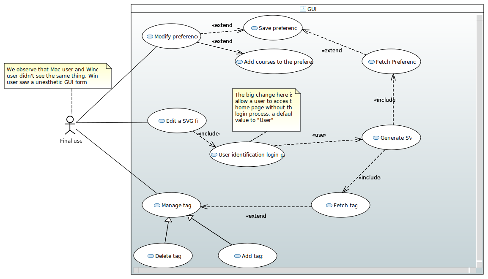
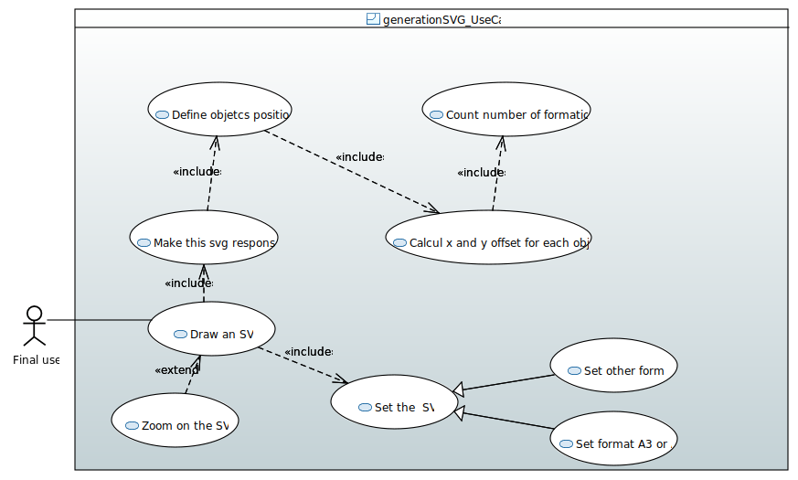
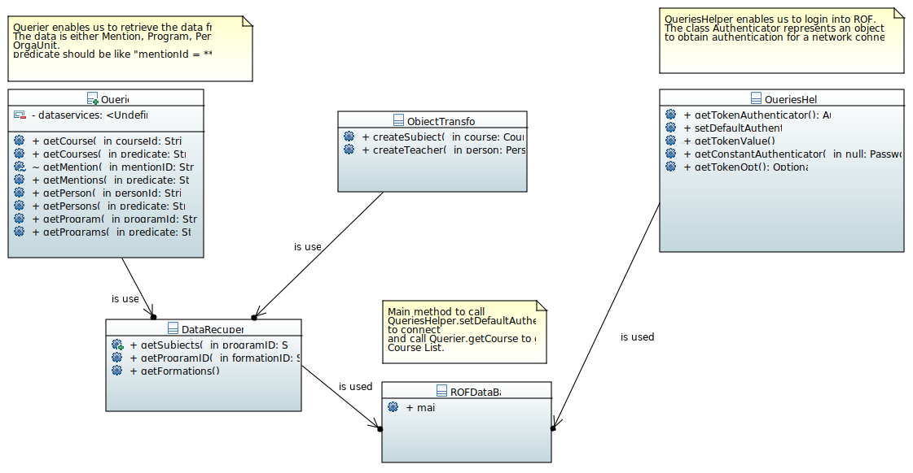

= Diagram Documentation File

== Existing

=== University Class Diagram (Raphaël et Camille)

The `Department` class represents the different Departments of the university (MIDO, LSO ...)
The `Formation` class is abstract, which will allow us to create other types of training with the same "default data" (a title, a grade ...)

The `UniversityClassDiagram` diagram allows you to view the different links between the classes in this package.
 
This package seems complete and functional to us, so we do not anticipate any major developments on this part of the project. However, additions of methods or attribute can be made if necessary to allow another evolution.

=== GUI Use Case Diagram (Zhenyi et Marcellino)

image::../docs/Diagrams/Existing/GUIUseCaseDiagram.svg[GUI Use Case Diagram]

The "GUI" aspect of the project is coded in the `view` package.
At this point of the project, there is no specific main class to run.
If we run the GUISVGLoginForm, the final user is able to log in (if the final user name is known by the application, coded in "model" database class.
On the other hand, if the programmer run another class, the name user is by default "ocailloux".

The tag is saved in an xml file in `src/main/resources/tags/`

=== Controller Use Case Diagram (Zhenyi et Marcellino)

Based on the model of MVC system, the generation of a svg file require a control step.
By running `ControllerSVG` from `Controller` package, the application proceed to a user validation. (if the user is unknown by the application, the SVG file won't generate.
To make the application runnable (able to generate SVG file), the previous programmer set, as a hard-coded procedure, the user `cocolollipop`.

The controller step is not a priority in term of evolution, thus we decided to do anything.

=== Paper Class Diagram (Raphaël et Camille)

image::../docs/Diagrams/Existing/PaperClassDiagram.svg[Paper Class Diagram]

The `Paper` class allows you to represent as an object papers in a certain format (determined by the dimXCanvas and dimYCanvas attributes)
The `PaperA3` class allows you to create a Paper type object having the dimensions of an A3 sheet (by calling the constructor of the super class and setting the attributes corresponding to A3 format)
The `PaperA4` class allows you to create a Paper type object having the dimensions of an A4 sheet (by calling the constructor of the super class and setting the attributes corresponding to A4 format)
The `PaperOther` class allows you to create a Paper type object with dimensions chosen by the program user (by calling the constructor of the super class and putting attributes corresponding to the user's choice)
The `FactoryPaper` class allows you to generate a Paper type object (either `PaperA3`, `PaperA4`, or `PaperOther`)
 
The https://github.com/marcellinodour/MIDO-SVG/blob/master/docs/Diagrams/Existing/PaperClassDiagram.svg[Paper Class Diagram] allows you to visualize the different links between the classes of this package.

This package appears to us to be complete and functional, so we do not expect any developments on this part of the project.

=== XML Class Diagram (Jérémie et Sarra)

The `xml` package enables us to generate tags and therefore make the link with the subjects.
Each tag has a name and a list of subjects.
The TagStore class allows you to store several tags.
In the future, we want to be able to choose the courses by tags. 

The `XMLMain` class (in the xml-to-java package) is used to retrieve an XML file and extract the data (name, first name, address, etc.) to store it in a hash table. Afterwards, this hash table will be used to fill the Database (Database class). 
Since we are planning to retrieve these informations directly from Dauphine's DSI, this class won't be useful anymore.  

=== JUnit Use Case Diagram (Zhenyi et Marcellino)

image::../docs/Diagrams/Existing/JUnitUseCaseDiagram.svg[JUnit Use Case]

Up to now, the `GUIJUnitTest` in `jUnit` package is only able to test if the translation of xml to JAVa language if working well by checking the number of "M1" is hard-coded in this application. 

=== SVG Class Diagram (Jérémie et Sarra)

This diagram models the `svg-generator package`. It represents an overview of drawing an SVG process: the classes involved and the methods.
However, the process is much detailed in the SVG Sequence Diagram. 

=== SVG Sequence Diagram (Zhenyi and Camille)

This diagram represents the way a SVG image is generated by using the `View` package 

There is another way to generate the SVG image by using the `ControllerSVG` class in the `controller` package that makes the SVG image more responsive (according to the default settings)

== Coming Soon

=== Database Use Case Diagram (Raphaël et Camille)

`Database` is a class that allows you to create and store all the data used by the `MIDO-SVG` application. Thus, to add, modify or delete a training for example, you must modify the code of the `Database` class.
Indeed, when calling the constructor of the `DataBase` class, the program will create predefined objects, the data used for generating a diagram with the application are stored in hard.
 
This package does not seem effective. Indeed, for the data and therefore the diagrams created by the application to be up to date, it would be necessary to get the updated information and modify the code.
It requires a lot of work on a regular basis, and someone competent to do it. That’s why we’re planning an evolution.
We want to connect the application to the Dauphine database so that each time the application is launched, it goes to update its data automatically.
Initially, we plan to contact the Dauphine DSI to have access to the database. Then, we will find a solution who is represented by this diagram : https://github.com/marcellinodour/MIDO-SVG/blob/master/docs/Diagrams/ComingSoon/DatabaseUseCaseDiagram.svg[Database Use Case]

=== GUI Use Case Diagram (Zhenyi, Sarra, Jérémie, Marcellino)

Pretty much same elements that the https://github.com/marcellinodour/MIDO-SVG/blob/master/docs/Diagrams/JUnitUseCaseDiagram.svg[JUnit Use Case].
This is what we are planned to do :
[square]
* Saved the user preferences in a xml file and reuse it in a further launch application
* Be able to save courses preferences 
* Be able to access to the formation site by clicking on it

=== Generation SVG Use Case (Jérémie et Sarra)

This diagram presents some more evolutions than we judge necessary for the svg_generator package. 
Indeed, the result (the SVG drawing) is not entirely functional. One of the evolutions is the possibility to zoom in or out. This functionality allows you to see the whole graph at first and be able to zoom in according to the user's needs. - → This corrects the fact that you have to move with the elevators (in the existing one), which we had found a bit restrictive.
In addition, a second use case has been added: access the training pages from the SVG drawing. - → This will save us from putting a lot of informations in the drawing and therefore cluttering it up.

=== ROF Class Diagram (Raphaël et Sarra)

This diagram contains the classes that would be useful to retrieve the data directly from ROF. 
`Querier` Class enables us to get the mentions, programs, courses ... from ROF. 
`QueriesHelper` is essential to login into ROF. 
The third class `ROFMain` will be useful to store the data (retrieved with calling the two other classes) in a file which will be read by the SVG generator. 